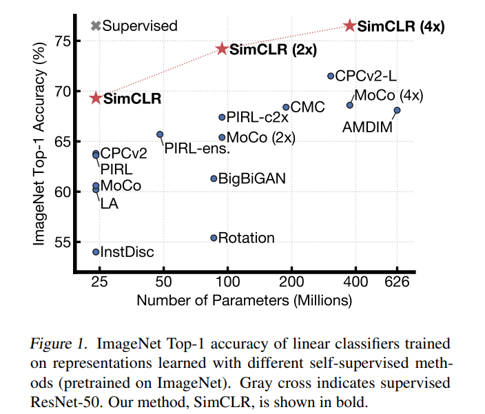
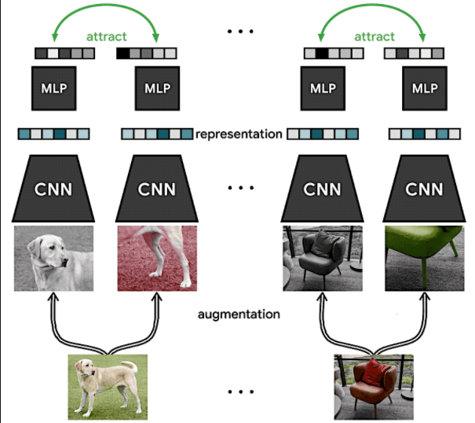
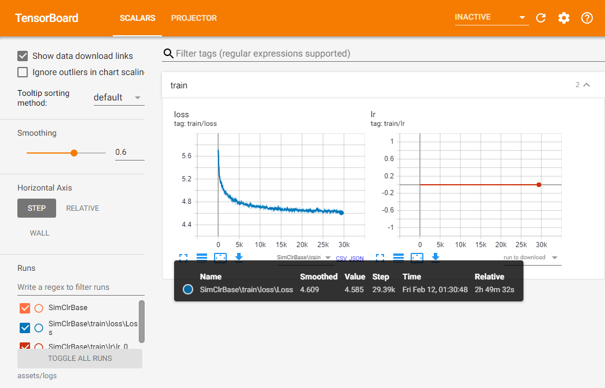
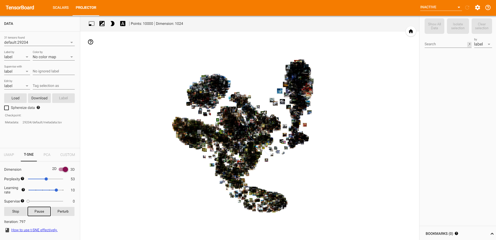

# SimCLR

A simplified tutorial for [A Simple Framework for Contrastive Learning of Visual Representations](https://arxiv.org/pdf/2002.05709v3.pdf).

## 1. Installation
#### Conda
If CUDA 10.2 is compatible with your device, you can simply create your environment with 
```shell
$ conda create --name <env> --file req_conda.txt
```

#### pip
If one does not use Conda, you can manually install PyTorch from this [link](https://pytorch.org/get-started/locally/) and get your other requirements by running:
```shell
$ pip install -r req_pip.txt
```


## 2. Introduction

SimCLR is a framework of contrastive learning that was introduced by Ting Chen et. al. in [A Simple Framework for Contrastive Learning of Visual Representations](https://arxiv.org/pdf/2002.05709v3.pdf) at ICML 2020(😮), that allows one to learn good representations form data without any express supervision. What does this mean? Think of fitting a CNN model on a completly new dataset, instead of training it from scratch, it is a very common practice to start with the weights trained on a learge and generalistic dataset, such as ImageNet (1000 classes with 1000 images/class). This speeds up the training process and helps one achieve better results, because the used encoder learned very good representations from data. However, when we don't have access to such a model, or when we want to train our model on a new dataset that has very few labeled samples we can use this method to obtain a similar effect.  In the image below, one can see that by using this method, one can acieve performances similar with supervised approaches. 

<p align="center">
    
</p>

Long story short, this SimCLR is a 🏃‍♂️training method🏃‍♂️ that can be used to create a pretrained model for your custom dataset and not requiring any labels. It does this by maximizing the agreement between differently augmented views of the same image via a *contrastive loss* in the latent space. The produced network, can be further used to solve tasks, but keeping it would require some sorth of supervision. 

 During training, this framework is composed of 4 main components (for each component, more information will be presented in the **Task** section below): 

<p align="center">
    
</p>


1. **Image augmentation :** Module responsible with generating two correlated views of the same example. 
2. **Encoder:** An image encoder (CNN) that is used to extract latent representation vectors from the augmented samples . 
3. **Projection Head:** A small neural network, with a few linear units, that is used to map the latent space of the encoder output to another latent space where contrastive loss can be applied. 
4. **Contrastive Loss Function:** Given a set of examples including a positive(simialr) pair of examples, the contrastive prediction task has to identify them.
5. **The training itself**

## 3. Tasks

For this tutorial, a starter project was developed, such that it will allow one to only focus on important aspects. Besides this, if everything is done correctly, one will be able to see the latent space representation in Tensorboard. Because we do not have access to a vaste amount of computing resources, we will use the CIFAR10 dataset. 


### 3.1 Data augmentation

In this first section, one will have to implement the image augmentation module, in the file ```core/data/data_augmentation.py``` where a base code structure is provided.

The module should be a callable object that takes as parameter an image and returns 2 augmented versions of it. The **Resize**, **ToTensor** and **Normalize** operations are common for both augmentations transforms. One can use the transformations provided by Torchvision or Abumentations

**NOTE**: For the Normalization layer, please use the values from ImageNet, they are provided in the file.

**Sample usage:**

```python
augModule = ImageTransforms(imgSize)
image     = cv2.imread(...) # H, W, C

augImage1, augImage2 = augModule(image)
```

**Refferences**

1. Check page 12 of the original paper for more details - [arxiv](https://arxiv.org/pdf/2002.05709v3.pdf)

2. Official implementation (Tensorflow) - [GitHub](https://github.com/google-research/simclr/blob/master/data_util.py) 

3. Un-official implementation (PyTorch) - [GitHub](https://github.com/Spijkervet/SimCLR/blob/master/simclr/modules/transformations/simclr.py) - do not cheat 😑

**Pseudo-python-code hint**

```python
class ImageTransforms:
    def __init__(self, imgSize):
        self.firstAugTrans  = sefl.get_first_aug(imgSize)
        self.secondAugTrans = sefl.get_second_aug(imgSize)
   # . . .      
   # define get_first_aug & get_second_aug
   # . . .
        
    def __class__(self, image)
        firstAug  = self.firstAugTrans(image)
        secondAug = self.secondAugTrans(image)
      
        return firstAug, secondAug
```


### 3.2 Neural network - encoder

For this part, because it would be beyond the purpose of this tutorial to implement from scratch an encoder such as ResNet, one will only have to configure such a network to produce the desired outputs. For this, one will have to modify the ```core/nn/networks/simclr.py```, where the ```SimCLR``` class is deffinied. 

For this task, one will have to work in the ```.build()``` method, where a Resnet model should be defined. This model should take as input a color image [B, C, H, W] and output a latent representation ***h*** extracted from this [B, H_LATENT] (where H_LATENT is the size of the latent representation).  The output of this model wil be fed to the project funciton. 


**Sample usage:**

This is the high level view of the model

```python
class SimCLR(nn.Module, Configurable):
    def __init__(self, *args, **kwargs):
        [...]
        
    def build(self):
        self.encoder = ResNet( .... )              # <=== You will work here ⚠⚠⚠
        self.project = [...]
        
        return self
       
    def forward(self, inTensor):
        h = self.encoder(inTensor)                 # <=== The effect ⚠⚠⚠
        z = self.project(h)
        
        return h, z
   
model = SimCLR(cfg)
h1, _ = model(firstAugImage)
h2, _ = model(secondAugImage)
```

**Pseudo-python-code hint**

This is encoder definition in the ```.build()``` method. By answering to this question, it will be way easier. 

```python
ResNet(
    inChNo      = self.inChNo,         # int       : How many channels in RGB?
    outChNo     = self.latentChNo,     # int       : Check and see the paper for latent size 😉
    norm        = self.norm,           # str *     : We all know that BatchNorm helps, but what about GroupNorm?😝
    normKwargs  = self.normKwargs,     # dict      : What params does BatchNorm have? (default: {})
    activ       = self.activ,          # str *     : Well, which is our favourite nonlinearity? 🤔
    activKwargs = self.activKwargs     # dict      : What params does activ have? Maybe you can speed it up(default: {})
    strides     = self.encoderStrides, # list[int] : A list of 6 ints, where an element represents the stride at each step in ResNet
    downType    = 'maxpool',           # str       : Ho do we reduce spatial dims? ['maxpool', 'avgpool' or 'conv'] 
    lastPool    = True,                # bool      : This will take the last feature map, and remove the spatial dims by AvgPool
    archType    = self.archType,       # str       : ResNet architecture ['18','34']. For ResNet18, 1 epoch ~ 1 min (total 100 epochs)
    ).build()

# * Name taken from PyTorch (ex: BatchNorm2d, GroupNorm2d, ReLU, Tanh, etc)
```


**References**

1. Official Tensorflow implementation [GitHub](https://github.com/google-research/simclr/blob/master/resnet.py)
2. Un-official Pytorch implementation  1 [GitHub[model]](https://github.com/Spijkervet/SimCLR/tree/master/simclr),  [GitHub[init]](https://github.com/Spijkervet/SimCLR/blob/847eac3cb4f2e4102451c0c485d6968efa230901/main.py#L99), 
3. Un-official Pytorch implementation  2 [GitHub](https://github.com/PyTorchLightning/pytorch-lightning-bolts/blob/86e3f52308fa02e2a988b4977858a945f7d15ab2/pl_bolts/models/self_supervised/resnets.py#L142)


### 3.3  Neural network - projector

For this part, one will define a projection function by using the the MLP class and add it to the same ```SimCLR``` class. For this, one will have to modify the same ```core/nn/networks/simclr.py```. The projection module should take as input a latent reprezentation ***h*** [B, H_LATENT] and project to a smaller latent space ***z***  [B, Z] where the *contrastive loss* will be applied.


The initialization process is similar with the one described at the previous module.

**Sample usage:**

```python
class SimCLR(nn.Module, Configurable):
    def __init__(self, *args, **kwargs):
        [...]
        
    def build(self):
        self.encoder = ResNet( .... )  
        self.project = MLP(...)                 # <=== You will work here ⚠⚠⚠
        
        return self
       
    def forward(self, inTensor):
        h = self.encoder(inTensor)
        z = self.project(h)                     # <=== The effect ⚠⚠⚠
        
        return h, z
   
model = SimCLR(cfg)
_, z2 = model(firstAugImage)
_, z2 = model(secondAugImage)
```


**Pseudo-python-code hint:**

This is projection function definition in the ```.build()``` method. By answering to this question, it will be way easier to configure it. 

```python
MLP(
    inChNo          = self.latentChNo,   # int       : How many channels in h latent?
    outChNo         = self.outChNo,      # int       : Check and see the paper for latent size [rule of thumb dim(Z)<dim(H)] 😉
    layerCfg        = self.mlpLayer,     # list[int] : mlp layer config, should have at most 3 hidden layers ex [64,64]
    useBias         = self.useBias,      # bool      : Search in the paper. Usually not that revelant.
    norm            = None,              # str *     : We all know that BatchNorm helps, but not here, so no normalization😝
    normKwargs      = {},                # dict      : No normalizaiton.. no arguments for it
    activ           = self.activ,        # str *     : Well, which is our favourite nonlinearity? 🤔
    activKwargs     = self.activKwargs   # dict      : What params does activ have? Maybe you can speed it up(default: {})
    dropRate        = self.dropRate,     # float     : Dropout rate, in interval [0, 1]
    dropLayers      = dropLayers,        # int       : Apply dropout on this last no of layers
    lastActiv       = None,              # str *     : No activation prefferably
    lastActivKwargs = {},                # str       : No activation, no arguments 😊
    ).build()

# * Name taken from PyTorch (ex: BatchNorm2d, GroupNorm2d, ReLU, Tanh, etc)
```


**References**

1. Official Tensorflow implementation [GitHub](https://github.com/google-research/simclr/blob/master/resnet.py)

2. Un-official Pytorch implementation 1 [GitHub[model]](https://github.com/Spijkervet/SimCLR/tree/master/simclr)

3. Un-official PyTorch implementation 2 [GitHub ](https://github.com/PyTorchLightning/pytorch-lightning-bolts/blob/86e3f52308fa02e2a988b4977858a945f7d15ab2/pl_bolts/models/self_supervised/simclr/simclr_module.py#L46) 

   

### 3.4. Contrastive loss function

 For this task, one should implement the contrastive loss function described in the paper. Firstly please look at the subsection ```2.1 Method``` of the paper. Below it is cited the most relevant portion of it.

---

We randomly sample a minibatch of $N$ examples and define the contrastive prediction task on pairs of augmented examples derived from the minibatch, resulting in $2N$ data points. We do not sample negative examples explicitly.
Instead, given a positive pair, similar to \cite{chen2017sampling}, we treat the other $2(N-1)$ augmented examples within a minibatch as negative examples.
Let $\mathrm{sim}(u,v) = u^\top v / \lVert u\rVert \lVert v\rVert$ denote the dot product between $\ell_2$ normalized $u$ and $v$ (i.e. cosine similarity). Then the loss function for a positive pair of examples $(i, j)$ is defined as
$$
\begin{equation}
\label{eq:loss}
    \ell_{i,j} = -\log \frac{\exp(\mathrm{sim}( z_i, z_j)/\tau)}{\sum_{k=1}^{2N} {k \neq i}\exp(\mathrm{sim}( z_i, z_k)/\tau)}~,
\end{equation}
$$

where ${k \neq i} \in \{ 0,  1\}$ is an indicator function evaluating to $1$ iff $k \neq i$ and $\tau$ denotes a temperature parameter. The final loss is computed across all positive pairs, both $(i, j)$ and $(j, i)$, in a mini-batch. [...] We term it *NT-Xent* (the normalized temperature-scaled cross entropy loss).

---

One will have the implement the NTXent function in ```core/nn/loss/nt_xent.py ``` . 

OPTIONAL: Try to optimize this function such that it does not recompute the correlated samples each time.


**Sample usage**

```python
loss = NTXent(tempetature, *args, **kwargs)
[...]
hA, zA = model(augImageA)
hB, zB = model(augImageB)
[...]
loss(zA, zB)
[...]
loss.backward()
```

**Pseudo-python-code hint**

No hints.

**References**

- Official Tensorflow implementation      [GitHub](https://github.com/google-research/simclr/blob/6bf69ce127ae33e181e1a6c5777c84570cb5d147/objective.py#L34)
- Un-official PyTorch implementation 1  [GitHub](https://github.com/Spijkervet/SimCLR/blob/847eac3cb4f2e4102451c0c485d6968efa230901/simclr/modules/nt_xent.py)
- Un-official PyTorch implementation 2  [GitHub](https://github.com/PyTorchLightning/pytorch-lightning-bolts/blob/86e3f52308fa02e2a988b4977858a945f7d15ab2/pl_bolts/models/self_supervised/simclr/simclr_module.py#L256) - ◀ most usefull 🥇


### 3.5 Training

In this section, if one did everything correct, one will be able to train the model and see its results in ***Tensorboard*** (😮). For this, one will you the ```./train ``` directory, where there are 3 files to be considered:

-	``` train/main.py``` - script that starts the training
-	``` train/trainer.py``` - where all the modules required for training are initialized such as ```data```, ```networks```, ```losses```, etc, and where the training logic is implemented ```optimiz_ parameters()```
-	```train/config.py``` - where a skeleton for allowed configurations is. This is file only provides some default, and usually, for each experiment, one will have to merge it with an .yaml file

**Start training:**

``` shell
$ python train/main.py -l assets/experiments/base_simclr.yaml
```

The results will also be visible in Tensorboard. For this, the common logDir is ```assets/logs ``` 

``` shell
$ tensorboard --logdir assets/logs
```

## 4. Results
This results were obtained using this configuration ```assets/experiments/base_simclr.yaml```:
The dataset of choice is CIFAR10.

<p align="center">
    
</p>

And these are some intermediary results obtained with **t-SNE**:

<p align="center">
    
</p>


## 5. Acknowledgement

Let your divine entity of choice bless:
    - [Spijkervet](https://github.com/Spijkervet)
        - [PyTorch Lightning Bolts](https://github.com/PyTorchLightning/pytorch-lightning-bolts)

Consider citing the original paper if you found this useful:
```
@inproceedings{chen2020simple,
  title={A simple framework for contrastive learning of visual representations},
  author={Chen, Ting and Kornblith, Simon and Norouzi, Mohammad and Hinton, Geoffrey},
  booktitle={International conference on machine learning},
  pages={1597--1607},
  year={2020},
  organization={PMLR}
}
```
